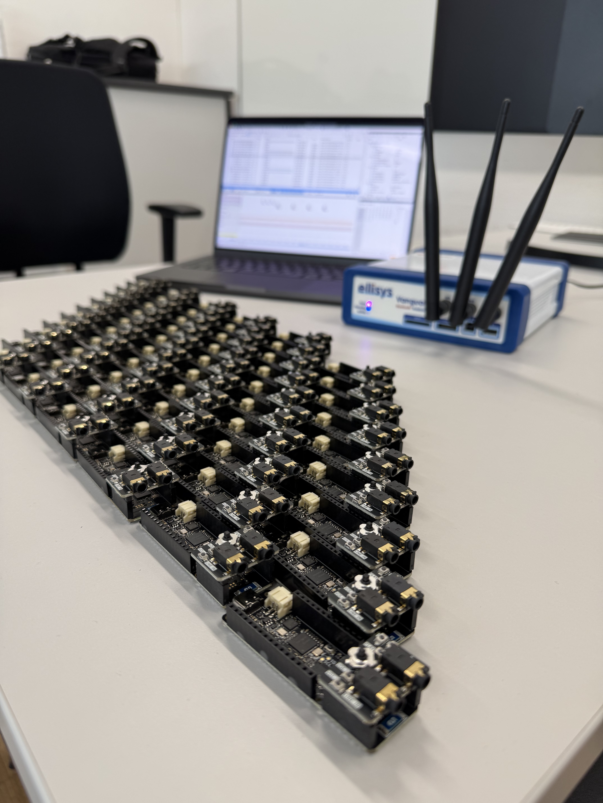

# LE Audio Playground

**An open hardware platform for Bluetooth LE Audio research, prototyping, and teaching.**

<p align="center">
  
</p>

The **LE Audio Playground** is a compact development platform designed to make experimenting with **Bluetooth LE Audio** simple and accessible. Built around the **Nordic nRF5340**, it combines a powerful Bluetooth SoC with stereo audio, integrated debugging, USB connectivity, battery operation, and flexible expansion in a single open hardware platform.

Designed at **Graz University of Technology**, the board provides a practical foundation for LE Audio research, prototyping, and education while remaining fully open and easy to extend.

## Highlights

- **Nordic nRF5340** dual-core Bluetooth SoC
- **MAX9867 stereo audio codec**
- Stereo analog audio input and output
- **USB Audio** connectivity
- Onboard digital **PDM microphones**
- Integrated **SEGGER J-Link** debugging and programming
- Single **USB-C** connection
- USB and **LiPo/Li-ion battery operation**
- Onboard antenna and **U.FL** connector for external antennas
- Expansion headers for custom hardware and audio interfaces
- Fully **open KiCad hardware design**

## Open Hardware

The complete schematic and PCB design are available in this repository and can be modified directly in **KiCad**.

---

Developed at the **Institute of Technical Informatics, Graz University of Technology**.
```
